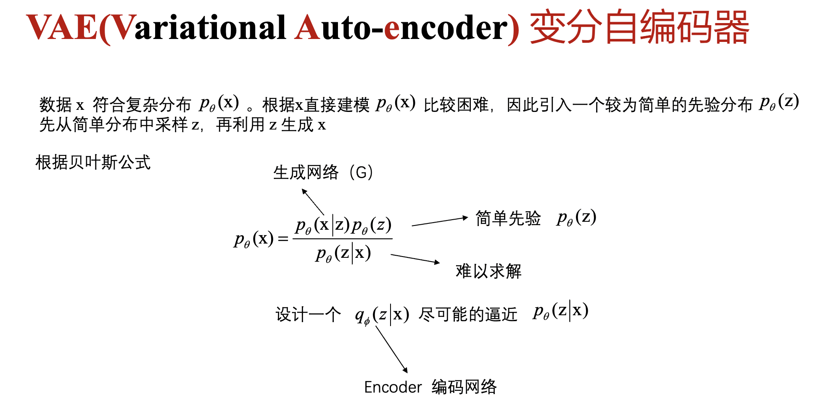
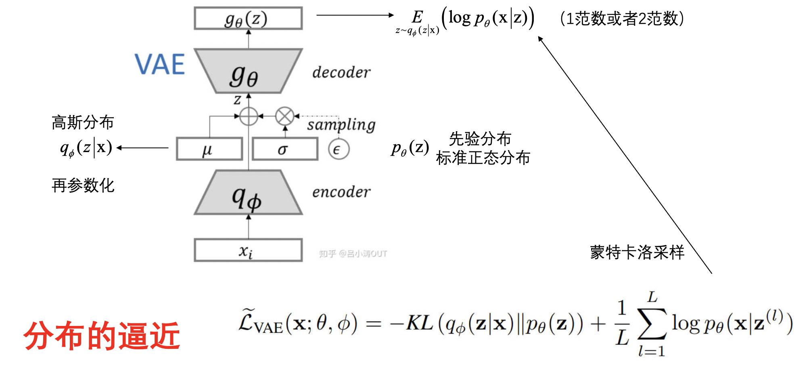
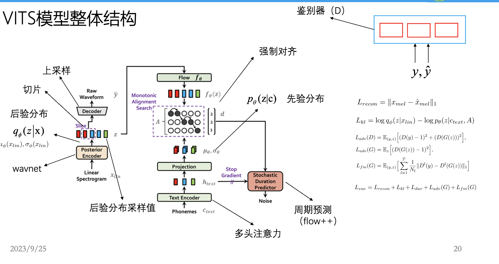

# vae 

## 概念

令encoder 生成的分布和先验分布尽可能相似  
从encoder 生成的分布的分布中采样z，再用z生成x期望最大

在变分自编码器（VAE）中，目标是通过学习一个潜在变量 \( z \) 的分布 \( q_\phi(z|x) \)，使其尽可能接近一个简单的先验分布 \( p_\theta(z) \)。这样做的目的是为了能够有效地从潜在空间中采样，并生成与输入数据 \( x \) 相似的输出。

### 具体步骤解释：

1. **编码阶段（Encoder）**：
   - 输入数据 \( $x$ \)被编码成潜在空间的分布 \( $q_\phi(z|x) $\)。这个分布通常被建模为一个高斯分布，其参数（均值和方差）由编码器网络输出。

2. **先验分布 \( $p_\theta(z)$ \)**：
   - 为了简化计算，先验分布一般选择简单的分布，比如标准正态分布。

3. **采样 \( $z $\)**：
   - 从编码器生成的分布 \( $q_\phi(z|x)$ \) 中采样潜在变量 \( z \)。

4. **解码阶段（Decoder）**：
   - 使用采样得到的 \( $z$ \)，通过解码器生成数据 \( $x$ \) 的重建 \( $p_\theta(x|z) $\)。

5. **优化目标**：
   - 使用变分推断，优化的目标是最大化证据下界（ELBO），即：
     \[
     $ \text{ELBO} = \mathbb{E}_{q_\phi(z|x)}[\log p_\theta(x|z)] - D_{KL}(q_\phi(z|x) \| p_\theta(z))$
     \]
   - 第一项是重建误差，确保生成的数据与输入数据相似。
   - 第二项是KL散度，确保 \($ q_\phi(z|x)$ \) 接近 \( $p_\theta(z) $\)。

通过这种方法，VAE能够生成高质量的样本，并在潜在空间中进行平滑的插值。图中展示了VAE的整体架构和目标，其中编码器和解码器通过神经网络实现。

**分布的逼近** 
这张图展示了变分自编码器（VAE）的架构和优化目标。以下是对图中各部分的解释：

### 编码器（Encoder）

- **输入数据 \( $x_i $\)**：输入数据被编码器 \( $q_\phi$ \) 处理。
- **高斯分布 \( $q_\phi(z|x)$ \)**：编码器输出的潜在变量 \( z \) 的分布被建模为高斯分布，参数化为均值 \( $\mu$ \) 和标准差 \( $\sigma $\)。
- **再参数化技巧**：为了使采样过程可微，采用再参数化技巧：\( $z = \mu + \sigma \cdot \epsilon$ \)，其中 \( $\epsilon$ \) 是从标准正态分布 \( $N(0, 1) $\) 中采样的噪声。

### 解码器（Decoder）

- **解码器 \( $g_\theta$ \)**：采样得到的 \($ z $\) 被输入到解码器，以生成数据的重建 \($ p_\theta(x|z)$ \)。

### 先验分布

- **先验分布 \($ p_\theta(z)$ \)**：对 \($ z $\) 的先验假设为标准正态分布。

### 目标函数

- **证据下界（ELBO）**：优化目标是最大化ELBO，公式如下：
  \[
  $\tilde{L}_{VAE}(x; \theta, \phi) = -KL(q_\phi(z|x) \| p_\theta(z)) + \frac{1}{L} \sum_{l=1}^{L} \log p_\theta(x|z^{(l)})$
  \]

  - **第一项**：KL散度，衡量编码器输出分布 \($ q_\phi(z|x) $\) 与先验分布 \($ p_\theta(z)$ \) 的差异，鼓励它们接近。
  - **第二项**：重建损失，衡量生成的数据 \( $p_\theta(x|z)$ \) 与输入数据的相似性。

### 蒙特卡洛采样

- **蒙特卡洛采样**：通过采样多个 \( $z $\) 来估计重建损失的期望。

这张图全面展示了VAE的工作流程和目标，通过编码器和解码器的联合优化，实现数据的生成和表示学习。

# vits整体结构

