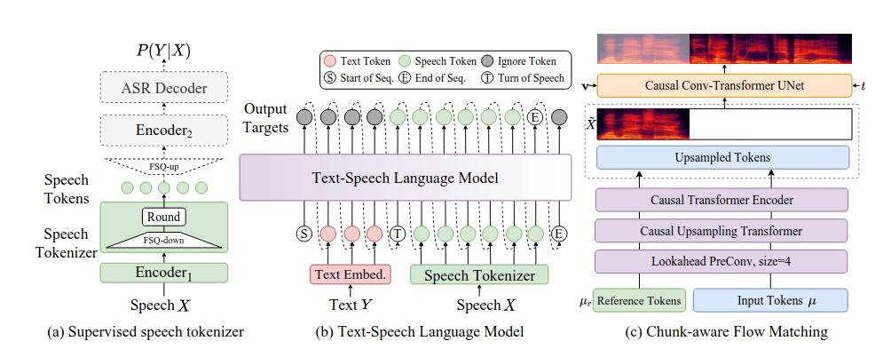
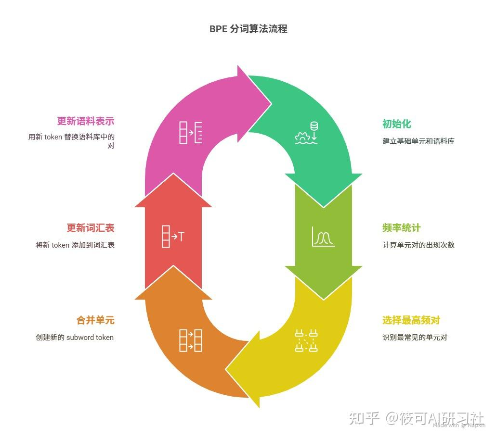
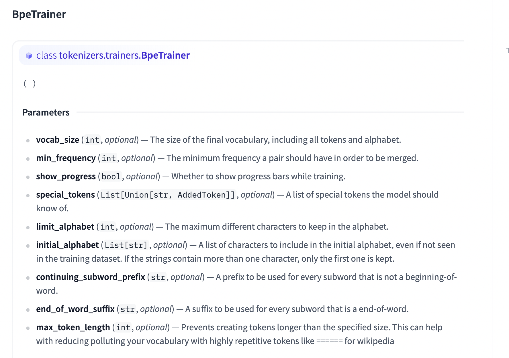
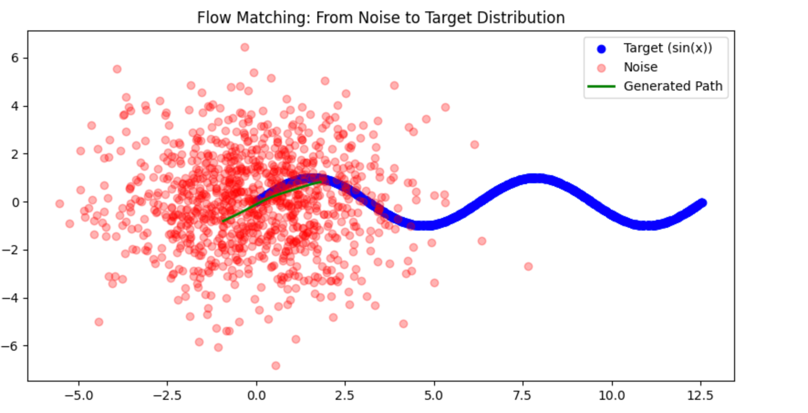
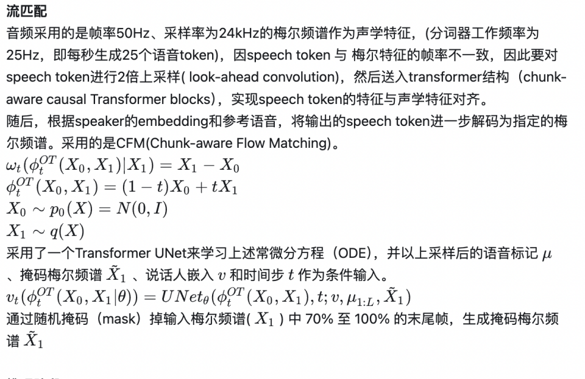
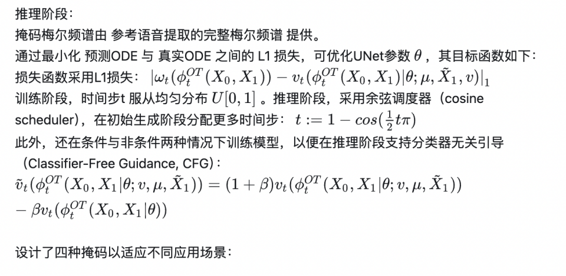
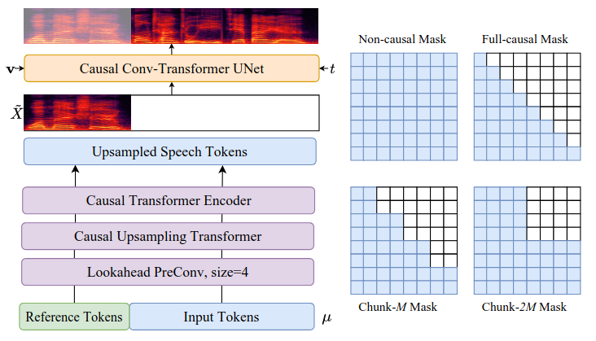

	cosyvoice

# 整体结构



[https://zhuanlan.zhihu.com/p/1903180962625454640](https://zhuanlan.zhihu.com/p/1903180962625454640)

# text tokenizer
因为开源的是所有语种，所以里面有很多的语种的词

可以说如果是开源的分词器一般都是一个单词一个token而我们只训英语的话就可以分的更细一些


## bpe分词器

英语采用12000 用开源的小黄脸上的训 语料就是wiki的 官网有教程 max_token_length=6



* BPE：基于频率合并字符对的次词算法。
* 优势：处理 OOV，语言无关性。
* 工具：`tokenizers` 库提供实现。
* 关键参数：`vocab_size`, `min_frequency`。
* 特殊符号：`[CLS]`, `[SEP]` 等用于模型输入。
* 主流库：TikToken, tokenizers, SentencePiece。
* [https://zhuanlan.zhihu.com/p/1902463999947285455](https://zhuanlan.zhihu.com/p/1902463999947285455)


## bbpe
字节级 BPE (Byte-Level BPE, BBPE) 是 BPE 算法的一个变种，它的特别之处在于，它不是在字符层面操作，而是直接在文本原始的 UTF-8 **字节**序列上进行操作

BBPE 之所以受到广泛欢迎，主要是因为它几乎不依赖于特定的语言。无论处理的是哪种自然语言、代码、特殊符号、表情符号，甚至是编码有些问题的文本，它都能用一套统一的方式来处理，不需要为不同的输入类型设计专门的预处理步骤

[https://zhuanlan.zhihu.com/p/1903226487211024779](https://zhuanlan.zhihu.com/p/1903226487211024779)


# speech tokenizer
Speech tokenizer 的采样率为

率为25Hz，即每秒生成25个语音token


flow的采样率为50hz 用采样率为24khz的梅尔频谱作为特征

因speech token 与梅尔特征的帧率不一致，因此要对speech token进行2倍上采样(look-ahead convolution)，然后送入transformer结构（chunk-aware causal Transformer blocks），实现speechtoken的特征与声学特征对齐。

语义的token采样率和 flow的不一致的原因

语义的提取的可以更粗一些

而flow用来生成音频需要更精细一些


cosyvoice2 用的是阿里的 sensevoice large 一个识别的encoder 不过是多任务的 提取语义信息

他相比cosyvoice1 又vq 改为fsq  


### FSQ
[https://zhuanlan.zhihu.com/p/704992732](https://zhuanlan.zhihu.com/p/704992732)

在FSQ模块中，中间表征H先被投影至D维低秩空间，各维度值通过有界取整运算ROUND量化到区间[−K, K]。接着，量化后的低秩表征H̄被重新投影回原始维度 H~ ，供后续模块使用：

有限标量量化(FSQ)模块：通过离散化连续特征增强模型鲁棒性
旋转位置编码：替代传统位置编码，更好地建模长序列依赖
有界取整运算：防止量化值溢出，保持数值稳定性

H¯=ROUND(Projdown(H))
H^=Projup(H¯)
在训练阶段，采用[直通估计](https://zhida.zhihu.com/search?content_id=257392572&content_type=Article&match_order=1&q=%E7%9B%B4%E9%80%9A%E4%BC%B0%E8%AE%A1&zhida_source=entity)（straight-through estimation）来近似计算FSQ模块和Encoder1的梯度。通过将量化后的低秩表征 h¯i 转换为(2K+1)进制索引，即可获得语音标记：
μi=∑j=0D−1h¯i,j(2K+1)j
分词器工作频率为25Hz，即每秒生成25个语音token。
**知识点补充**
直通估计（STE）是一种在深度学习中用于处理不可微分操作的技术，特别是在涉及离散变量或非连续函数的场景中。它的核心思想是在反向传播过程中近似梯度，使得原本不可微分的操作能够被优化。
前向传播：在前向传播时，STE按照正常的不可微分操作执行。例如，在二值化神经网络中，前向传播时会将权重或激活值量化为二值（如+1或-1）。
反向传播：在反向传播时，STE会近似梯度，而不是直接使用不可微分操作的梯度。通常，STE会将梯度直接传递到输入，忽略不可微分操作的影响。例如，在二值化神经网络中，STE会将梯度直接传递到未量化的权重，而不考虑量化操作。


# flow
## **flow matching原理**

[Flow Matching](https://zhida.zhihu.com/search?content_id=257392572&content_type=Article&match_order=1&q=Flow+Matching&zhida_source=entity) 的核心是通过定义一个从简单分布 p0(x) 到目标分布 p1(x) 的概率路径 pt(x) ，其中 t∈[0,1]t∈[0,1] 。这个路径可以是任意的，但通常选择线性插值或基于扩散的路径。

**流场的定义**
假设我们有一个简单分布 p0(x) （如高斯分布）和一个目标分布 p1(x) ，我们可以定义概率路径为： pt(x)=(1−t)p0(x)+tp1(x)
流场 vt(x) 描述了数据点 x 在时间 t 上的变化方向。它的定义基于概率路径 pt(x) 的演化。
假设数据点 xt 随时间 t 的变化满足以下常微分方程（ODE）
dxtdt=vt(xt)

**目标函数**
损失函数定义为目标流场 vt(xt) 和模型预测的流场 v^t(xt) 为的均方误差 Et,xt[|vt(xt)−v^t(xt)|2] 。

**训练过程**
采样时间点：从 [0,1] 中均匀采样时间点 t 。  
采样数据点：从概率路径 pt(x) 中采样数据点 xt 。  
计算目标流场：根据概率路径 pt(x) 计算目标流场 vt∗(xt) 。  
预测流场：使用模型预测流场 v^t(xt)  
计算损失：计算流场的均方误差 |vt(xt)−v^t(xt)|2  
更新模型：通过梯度下降法更新模型参数，最小化损失函数。

**采样过程**

初始化：从简单分布 p0(x) 中采样初始数据点 x0 。
求解ODE: 使用训练好的流场 v^t(xt) ，通过数值方法（如欧拉法或 Runge-Kutta 法）求解以下 ODE：
dxtdt=v^t(xt)
生成样本: 在(t=1)时，得到生成的数据点 x1 ，它近似服从目标分布 p1(x) 。

**欧拉法（Euler Method）**

欧拉法是一种显式数值积分方法，用于近似ODE的解。其更新公式为：
xt+Δt=xt+Δt⋅vt(xt)


## 代码
我调重点写一下

```
# 线性插值生成中间点
    xt = (1 - t) * x0 + t * x1
  
    # 模型预测向量场（直接传入t，无需squeeze）
    vt_pred = model(xt, t)  # t的维度保持不变
  
    # 目标向量场：x1 - x0
    vt_target = x1 - x0
  
    # 损失函数
    loss = torch.mean((vt_pred - vt_target)**2)
 
 # 推理
 x = noise_data[0:1]  # 初始噪声点
trajectory = [x.detach().numpy()]

tag = torch.from_numpy(np.array([1]))
# 数值求解ODE（欧拉法）
t = 0
delta_t = 1 / num_steps
with torch.no_grad():
    for i in range(num_steps):
        vt = model(x, torch.tensor([[t]], dtype=torch.float32))
        t += delta_t
        x = x + vt * delta_t  # x(t+Δt) = x(t) + v(t)Δt
        trajectory.append(x.detach().numpy())

trajectory = torch.tensor(trajectory).squeeze()
```
代码十分简单：

```
import torch
import torch.nn as nn
import matplotlib.pyplot as plt
import numpy as np

# 超参数
dim = 2         # 数据维度（2D点）
num_samples = 1000
num_steps = 50  # ODE求解步数
lr = 1e-3
epochs = 5000

# 目标分布：正弦曲线上的点（x1坐标）
x1_samples = torch.rand(num_samples, 1) * 4 * torch.pi  # 0到4π
y1_samples = torch.sin(x1_samples)                      # y=sin(x)
target_data = torch.cat([x1_samples, y1_samples], dim=1)

# 噪声分布：高斯噪声（x0坐标）
noise_data = torch.randn(num_samples, dim) * 2

class VectorField(nn.Module):
    def __init__(self):
        super().__init__()
        self.net = nn.Sequential(
            nn.Linear(dim + 1, 64),  # 输入维度: x (2) + t (1) = 3
            nn.ReLU(),
            nn.Linear(64, dim)
        )
  
    def forward(self, x, t):
        # 直接拼接x和t（t的形状需为(batch_size, 1)）
        return self.net(torch.cat([x, t], dim=1))
        
model = VectorField()
optimizer = torch.optim.Adam(model.parameters(), lr=lr)

for epoch in range(epochs):
    # 随机采样噪声点和目标点
    idx = torch.randperm(num_samples)
    x0 = noise_data[idx]  # 起点：噪声
    x1 = target_data[idx] # 终点：正弦曲线

    # 时间t的形状为 (batch_size, 1)
    t = torch.rand(x0.size(0), 1)  # 例如：shape (1000, 1)
  
    # 线性插值生成中间点
    xt = (1 - t) * x0 + t * x1
  
    # 模型预测向量场（直接传入t，无需squeeze）
    vt_pred = model(xt, t)  # t的维度保持不变
  
    # 目标向量场：x1 - x0
    vt_target = x1 - x0
  
    # 损失函数
    loss = torch.mean((vt_pred - vt_target)**2)
  
    # 反向传播
    optimizer.zero_grad()
    loss.backward()
    optimizer.step()

x = noise_data[0:1]  # 初始噪声点
trajectory = [x.detach().numpy()]

tag = torch.from_numpy(np.array([1]))
# 数值求解ODE（欧拉法）
t = 0
delta_t = 1 / num_steps
with torch.no_grad():
    for i in range(num_steps):
        vt = model(x, torch.tensor([[t]], dtype=torch.float32))
        t += delta_t
        x = x + vt * delta_t  # x(t+Δt) = x(t) + v(t)Δt
        trajectory.append(x.detach().numpy())

trajectory = torch.tensor(trajectory).squeeze()

print(trajectory[-1] / (torch.pi / 10 * 4))

# 绘制向量场和生成轨迹
plt.figure(figsize=(10, 5))
plt.scatter(target_data[:,0], target_data[:,1], c='blue', label='Target (sin(x))')
plt.scatter(noise_data[:,0], noise_data[:,1], c='red', alpha=0.3, label='Noise')
plt.plot(trajectory[:,0], trajectory[:,1], 'g-', linewidth=2, label='Generated Path')
plt.legend()
plt.title("Flow Matching: From Noise to Target Distribution")
plt.show()
```



## flow







非因果掩码（Non-causal Mask）：用于离线模式，可关注所有条件帧以获得最佳性能，适用于对延迟不敏感的场景。  
全因果掩码（Full-causal Mask）：为极低延迟场景设计，仅允许关注过去帧。  
分块-M掩码（Chunk-M Mask）：在延迟与性能间折衷，可利用过去和未来M帧信息，更适合首块低延迟生成。  
分块-2M掩码（Chunk-2M Mask）：通过牺牲更多延迟接近离线模式性能，用于级联生成块以提升质量。  
在小批量训练中，以均匀分布随机采样上述四种掩码。通过这种方式，单一流匹配模型可适配不同场景，降低部署复杂度。这种分块感知训练的另一优势是：更多上下文的掩码会作为教师，通过隐式自蒸馏机制提升少上下文掩码的性能。  


## 无分类器引导(Classifier-Free Guidance)


是一种用于生成模型（如扩散模型或生成对抗网络）的技术，旨在提高生成样本的质量和可控性，而无需依赖额外的分类器（classifier）。

具体来说，生成模型在生成样本时，会利用分类器的梯度信息来调整生成方向，使得生成的样本更符合某些特定的条件（例如，生成特定类别的图像）。然而，这种方法需要训练一个额外的分类器，增加了模型的复杂性和计算成本。

无分类器引导核心思想是在不使用额外分类器的情况下，实现类似的引导效果。它通过以下方式实现：

guided output=conditional output+guidance scale×(conditional output−unconditional output)

可以看到，本质思想是增大带条件的输出概率，减少不带条件的输出概率。从代码当中可以发现，这里面的条件就是prompt speech 部分的梅尔特征。

```
conds = torch.zeros([1, mel_len1 + mel_len2, self.output_size], device=token.device).to(h.dtype)
conds[:, :mel_len1] = prompt_feat  # prompt speech 梅尔特征
conds = conds.transpose(1, 2)
```
再训练过程当中会对语音特征进行插值，使其时间维度与编码器输出对齐，随机选择部分样本(50%的概率选择)，在这些样本中随机选取前30%的位置作为条件信息。

```
feat = F.interpolate(feat.unsqueeze(dim=1), size=h.shape[1:], mode="nearest").squeeze(dim=1)
conds = torch.zeros(feat.shape, device=token.device)
for i, j in enumerate(feat_len):
    if random.random() < 0.5:
        continue
    index = random.randint(0, int(0.3 * j))
    conds[i, :index] = feat[i, :index]
    conds = conds.transpose(1, 2)
```
# LLM


extra ignore id  增加额外的IGNORE_ID，让模型建模输入prompt进行合成的场景。最少留25个speech token 即1s的语音，计算训练loss

```
#       1. prepare llm_target; IGNORE_ID + speech_token + end_token
        # 增加额外的IGNORE_ID，让模型建模输入prompt进行合成的场景。最少留25个speech token
        # 
        extra_ignore_nums = [random.randint(0, max(1, speech_token_len[i] - 25)) for i in range(speech_token_len.size(0))]
        lm_target = [torch.tensor([IGNORE_ID] * (1 + text_token_len[i] + extra_ignore_nums[i]) + speech_token[i, extra_ignore_nums[i]:speech_token_len[i]].tolist() +
                                  [self.speech_token_size]) for i in range(text_token.size(0))]
        lm_target = pad_sequence(lm_target, batch_first=True, padding_value=IGNORE_ID).to(device)
```
 原本是 

```
# 1. prepare llm_target
        lm_target = [torch.tensor([IGNORE_ID] * (2 + text_token_len[i]) + speech_token[i, :speech_token_len[i]].tolist() +
                                  [self.speech_token_size]) for i in range(text_token.size(0))]
        lm_target = pad_sequence(lm_target, batch_first=True, padding_value=IGNORE_ID).to(device)
```