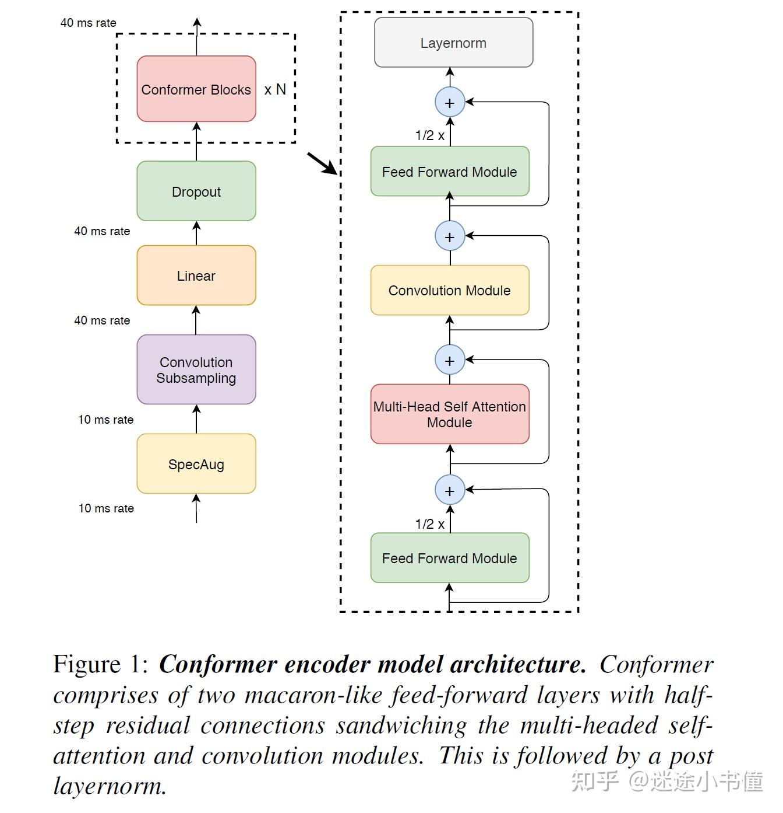
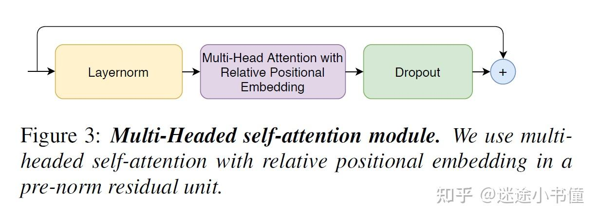
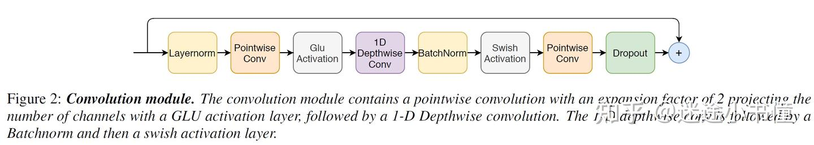

# nms极大值抑制算法

找上升沿尾点

代码
```python
def nms(score_map, kid_diff = 1, trigger_interval = 1, delay = -1, end_mark = 10000):
    for k, v in score_map.items():
        if len(v) == 0:
            continue
        v.sort()
        new_v = [v.pop(0)]
        last_t = new_v[-1][0]
        while len(v) > 0:
            xxx = v.pop(0)
            t_gap = xxx[0] - last_t
            if t_gap < trigger_interval:
                if int(xxx[1]) == end_mark:
                    last_t = -trigger_interval
                    continue
                elif int(xxx[1]) != int(new_v[-1][1]) and kid_diff != 0:
                    pass
                elif xxx[2] > new_v[-1][2]: # score
                    if delay < 0 or t_gap <= delay:
                        new_v.pop()
                    else:
                        pass
                else:
                    continue
            elif int(xxx[1]) == end_mark:
                continue
            new_v.append(xxx)
            last_t = new_v[-1][0]
        score_map[k] = new_v
```

nms 函数实现了一个类似于 NMS 的逻辑，但它应用于时间序列数据而不是空间检测框。以下是结合代码的具体解释：

数据结构：score_map 是一个字典，键是标识符（可能是不同的类别或对象），值是一个列表，列表中的元素是元组 (t, id, score)，表示时间戳、标识符和分数。

排序：代码首先对每个标识符的列表 v 按时间戳进行排序，以确保后续处理时是按照时间顺序进行的。

初始化：new_v 用于存储经过抑制后的结果，最初包含列表 v 中的第一个元素。

迭代处理：代码通过一个循环遍历 v 中的其他元素，计算当前元素与 new_v 中最后一个元素的时间差 t_gap。

时间间隔检查：如果 t_gap 小于 trigger_interval，则对当前元素进行进一步的检查：

如果当前元素的标识符是 end_mark，则直接跳过。
如果当前元素的 ID 不同于 new_v 中最后一个元素的 ID 且 kid_diff 不为零，则允许它们共存。
否则，通过比较分数决定是否替换 new_v 中最后一个元素。
更新：如果当前元素通过了所有检查，则将其添加到 new_v 中，并更新 last_t。

结果更新：最后，经过处理的 new_v 替换原来的列表 v，更新回 score_map。

# scores

beamhead * wkdhead
### splice
for neg：有标注的 找有声音的地方切
无标签，随机切 118+160 160给stage one
pos ：stage1 : 160 stage2: 118 
stage2，把kwd放在训练片段的尾部 在尾点附近随机切
stage1 pos，尾部预留7到15帧，保证min-max-pooling能找到目标

similar stage1送给stage2的尾点delay  most use stage2  at the same time add dn most in anjing ,fengji 靠泛化

# query asr

casual cfm : neg addsilence to solve error   
for example  九度 十九度

# splice

感受野 符合实际场景

# conformer

马卡龙结构
  



# ctc loss
前向后向算法 动态规划

三种情况 保持不变就是向右 调到下一个右下 跳马步 右下下 跳马步是只有在标签不同的情况才能跳马步

ctc最后都会停留在最后一个blank和倒数第二个label 